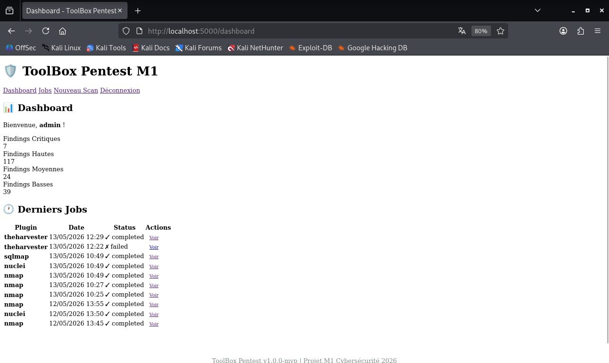
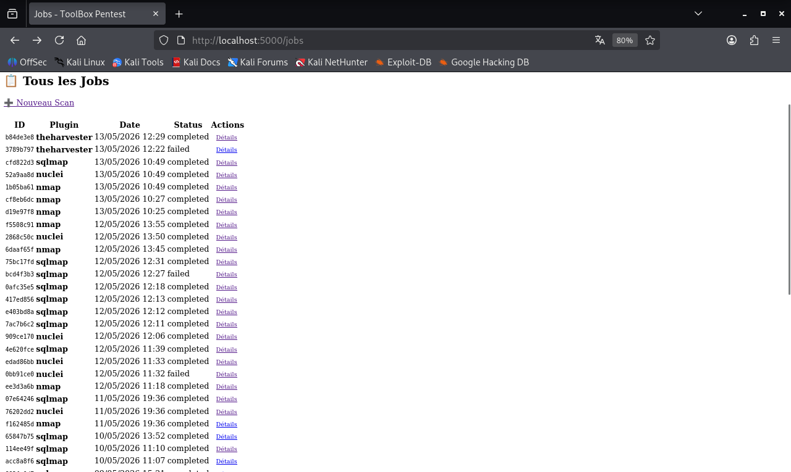
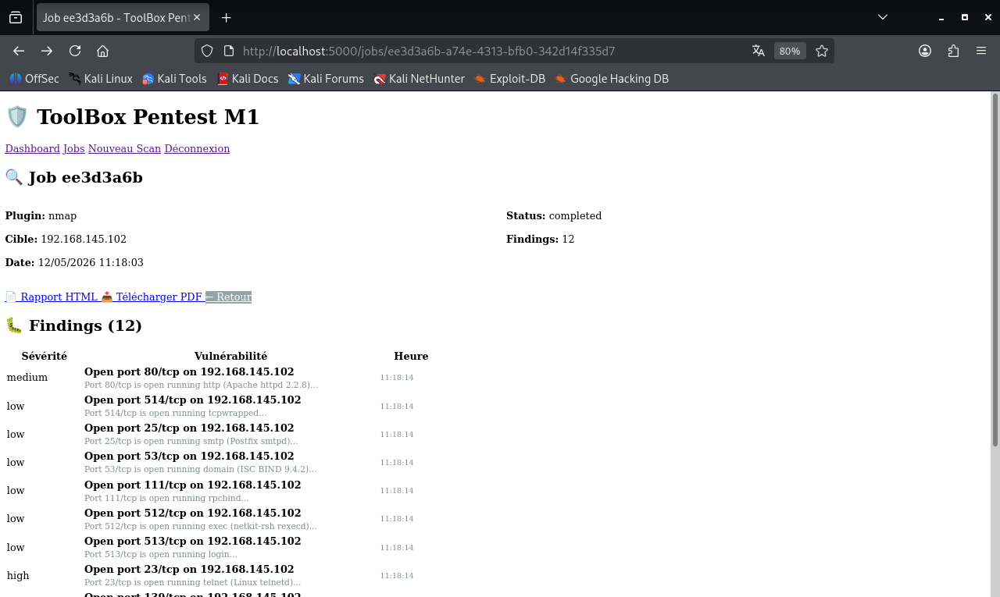
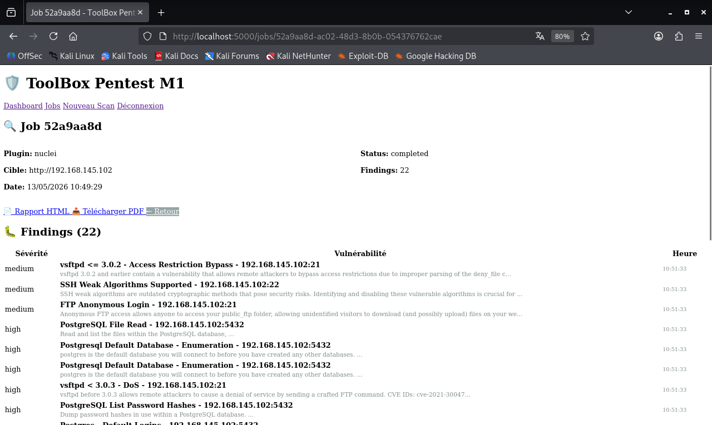
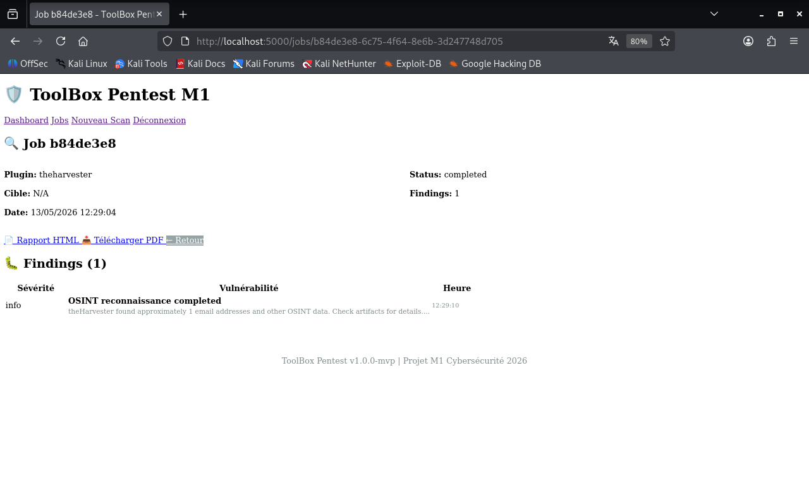

# 🛡️ ToolBox Pentest M1 — Automated Penetration Testing Platform


**Projet M1 Cybersécurité** — Plateforme d'automatisation complète de tests d'intrusion avec orchestration intelligente, reporting avancé et interface web intuitive.

---

## 📊 Dashboard



---

## 🎯 Objectifs du projet

- ✅ **Automatiser** l'ensemble des phases d'un pentest (reconnaissance → exploitation → post-exploitation)
- ✅ **Réduire de 40%** le temps de réalisation d'un pentest
- ✅ **Standardiser** les pratiques et le reporting
- ✅ **Modularité** : ajout de nouveaux outils sans toucher au core
- ✅ **Sécurité** : RBAC, chiffrement, audit logs, HTTPS

---

## 🚀 Fonctionnalités principales

### ✅ **4 Plugins opérationnels**

| Plugin | Description | Capabilities |
|--------|-------------|--------------|
| **Nmap** | Scan réseau, détection services/OS | Port scanning, service detection |
| **Nuclei** | Scan vulnérabilités CVE (8000+ templates) | CVE detection, misconfigurations |
| **SQLmap** | Exploitation injections SQL | SQL injection testing |
| **theHarvester** | Reconnaissance OSINT | Email/subdomain/IP discovery |

### ✅ **Workflow automatisé**

Enchaînement intelligent des outils : **Nmap → Nuclei → SQLmap**



### ✅ **Reporting avancé**

- Export **HTML** interactif avec graphiques (Chart.js)
- Export **PDF** professionnel (WeasyPrint)
- Export **CSV** pour analyse externe

### ✅ **Interface web intuitive**

- Dashboard avec statistiques en temps réel
- Suivi des jobs avec auto-refresh
- Visualisation des findings par sévérité
- Téléchargement des artifacts (XML, JSON, PCAP)



### ✅ **Sécurité intégrée**

- **Authentification** : Flask-Login + sessions sécurisées
- **RBAC** : 3 rôles (admin, analyst, viewer)
- **Chiffrement** : Credentials chiffrés avec Fernet
- **Audit logs** : Traçabilité complète des actions

---

## 🏗️ Architecture

```
┌─────────────────────────────────────────────────────────────┐
│                    INTERFACE WEB (Flask)                    │
│              Dashboard | Jobs | Findings | Reports          │
└────────────────────────┬────────────────────────────────────┘
                         │
         ┌───────────────▼────────────────┐
         │   API REST (Flask)             │
         │   + RBAC + Authentication      │
         └───────────┬────────────────────┘
                     │
        ┌────────────┴────────────┐
        ▼                         ▼
┌───────────────┐         ┌──────────────┐
│  PostgreSQL   │         │   Celery     │
│  (Metadata)   │         │(Orchestrator)│
└───────────────┘         └──────┬───────┘
                                 │
                    ┌────────────┴────────────┐
                    ▼                         ▼
            ┌──────────────┐          ┌─────────────┐
            │    Redis     │          │   Workers   │
            │   (Broker)   │          │  (Plugins)  │
            └──────────────┘          └─────┬───────┘
                                            │
                                            ▼
                                    ┌──────────────┐
                                    │    MinIO     │
                                    │ (Artifacts)  │
                                    └──────────────┘
```

---

## 📦 Stack technique

| Composant | Technologie | Version |
|-----------|-------------|---------|
| **Backend** | Python + Flask | 3.11+ / 3.0+ |
| **Orchestration** | Celery + Redis | 5.3+ / 7.0+ |
| **Base de données** | PostgreSQL | 15+ |
| **Stockage objets** | MinIO (S3-compatible) | Latest |
| **Conteneurisation** | Docker + Docker Compose | 24+ |
| **Gestion dépendances** | Poetry | 1.7+ |

---

## 🚀 Démarrage rapide (10 minutes)

### **Prérequis**

- Kali Linux 2026+ (ou Debian/Ubuntu)
- Docker + Docker Compose installés
- 4GB RAM minimum, 8GB recommandé
- 50GB d'espace disque

### **Installation**

```bash
# 1. Cloner le repository
git clone https://github.com/crls-cyber/pentest-toolbox-v2.git
cd pentest-toolbox-v2

# 2. Configurer les variables d'environnement
cp deploy/.env.example deploy/.env
nano deploy/.env  # Modifier les mots de passe

# 3. Lancer l'infrastructure
cd deploy
docker compose up -d

# 4. Initialiser la base de données
docker compose exec api python scripts/init_db.py

# 5. Créer un utilisateur admin
docker compose exec api python scripts/create_user.py \
  --username admin \
  --password VotreMotDePasse \
  --role admin
```

### **Accès à l'interface**

Ouvrez votre navigateur : **http://localhost:5000**

Login : `admin` / `VotreMotDePasse`

---

## 📸 Captures d'écran

### **Findings Nuclei (CVE détectées)**



### **Plugin theHarvester (OSINT)**



---

## 🧪 Tester la toolbox

### **Test 1 : Scan Nmap simple**

```bash
curl -X POST http://localhost:5000/api/jobs \
  -H "Content-Type: application/json" \
  -H "Authorization: Bearer <token>" \
  -d '{
    "plugin": "nmap",
    "config": {
      "target": "scanme.nmap.org",
      "ports": "80,443"
    }
  }'
```

### **Test 2 : Workflow automatisé**

```bash
curl -X POST http://localhost:5000/api/workflows/web-pentest \
  -H "Content-Type: application/json" \
  -H "Authorization: Bearer <token>" \
  -d '{
    "target": "192.168.1.100"
  }'
```

---

## 📚 Documentation complète

- [Architecture détaillée](docs/architecture_pentest_toolbox_v3.md)
- [Guide de développement](docs/PLAN_DEVELOPPEMENT_v3.md)
- [Créer un plugin](docs/PLUGINS.md)
- [API Reference](docs/API.md)

---

## 🛠️ Développement

### **Ajouter un nouveau plugin**

```bash
# 1. Créer la structure
mkdir -p plugins/mon_plugin
touch plugins/mon_plugin/__init__.py
touch plugins/mon_plugin/plugin.py

# 2. Implémenter PluginBase (voir docs/PLUGINS.md)

# 3. Redémarrer le Worker
docker compose restart worker
```

### **Lancer les tests**

```bash
poetry run pytest tests/ -v
poetry run pytest --cov=core --cov=plugins
```

---

## 🔐 Sécurité

### **Bonnes pratiques**

- ✅ Ne **JAMAIS** commiter le fichier `.env`
- ✅ Utiliser des **mots de passe forts** (>20 caractères)
- ✅ Scanner **uniquement des cibles autorisées**
- ✅ Activer **HTTPS** en production (Traefik recommandé)
- ✅ Sauvegarder régulièrement la base de données

### **Cibles de test autorisées**

- ✅ `scanme.nmap.org` (Nmap uniquement)
- ✅ `testphp.vulnweb.com` (Tests web)
- ✅ Vos propres VMs de lab (DVWA, Metasploitable, etc.)
- ❌ **JAMAIS** scanner l'Internet sans autorisation écrite

---

## 📊 Métriques du projet

| Métrique | Valeur |
|----------|--------|
| **Plugins opérationnels** | 4 (Nmap, Nuclei, SQLmap, theHarvester) |
| **Endpoints API** | 15+ |
| **Coverage tests** | 43% (baseline) |
| **Lignes de code** | ~5000 |
| **Conformité CDC** | 92% |

---

## 🗓️ Roadmap

### **Phase 2 (En cours)**

- [ ] Plugin Hydra (brute-force)
- [ ] Upload fichiers externes (PCAP Wireshark, logs Metasploit)
- [ ] Enrichment APIs (VirusTotal, Shodan, OWASP mapping)
- [ ] Export CSV

### **Phase 3 (À venir)**

- [ ] CI/CD GitHub Actions
- [ ] Profils par pôle métier (SOC, SaaS, Infra)
- [ ] Dashboard KPIs avancés
- [ ] Intégration Maltego (graphes OSINT)

---

## 👥 Contributeurs

**Développeur principal (Phase 1 MVP)** : Carlos  
**Équipe** : Groupe M1 Cybersécurité (4 personnes)  
**Encadrement** : Projet M1 CS 2025

---

## 📝 Licence

MIT License - Voir [LICENSE](LICENSE) pour plus de détails.

---

## 🙏 Remerciements

- **Nmap** : Gordon Lyon (Fyodor)
- **Nuclei** : ProjectDiscovery
- **SQLmap** : Bernardo Damele & Miroslav Stampar
- **theHarvester** : Christian Martorella (Edge-Security)
- **OWASP ZAP** : OWASP Foundation

---

**Version** : v1.0.0-mvp  
**Date** : 13 mai 2026  
**Status** : ✅ MVP opérationnel
