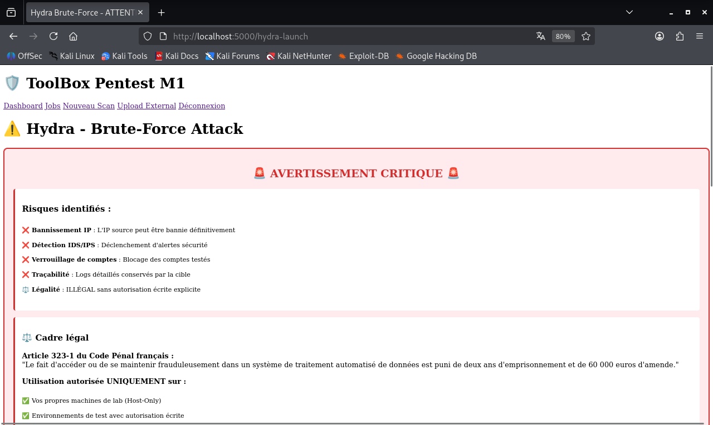

# 🛡️ Pentest Toolbox — M1 Cybersecurity Project

**Automated Penetration Testing Platform**

[](LICENSE)
[](https://www.python.org/)
[](https://www.docker.com/)

> **Academic Project** — M1 Cybersecurity (2026)  
> Automated modular toolbox for penetration testing with RBAC, reporting, and Docker orchestration.

---

## 📋 Table of Contents

- [Overview](#overview)
- [Features](#features)
- [Architecture](#architecture)
- [Tech Stack](#tech-stack)
- [Quick Start](#quick-start)
- [Plugins](#plugins)
- [Screenshots](#screenshots)
- [Documentation](#documentation)
- [Security](#security)
- [Legal Notice](#legal-notice)
- [Contributing](#contributing)
- [License](#license)

---

## 🎯 Overview

**Pentest Toolbox** is a modular penetration testing platform designed to:
- ✅ **Automate** reconnaissance, scanning, exploitation phases
- ✅ **Reduce** pentest time by 40%+ through orchestrated workflows
- ✅ **Standardize** practices with reusable plugins
- ✅ **Secure** access with RBAC (Admin, Analyst, Viewer)
- ✅ **Generate** professional reports (HTML, PDF, CSV)

**Target users:** Security analysts, pentesters, SOC teams, academic researchers.

---

## ✨ Features

### Core Capabilities

- 🔌 **5 Automated Plugins:**
  - **Nmap** — Network scanning + port discovery
  - **Nuclei** — CVE detection (8000+ templates)
  - **SQLmap** — SQL injection automation
  - **theHarvester** — OSINT (emails, subdomains)
  - **Hydra** — Brute-force attacks (with legal warnings)

- 📤 **2 External Parsers:**
  - **Wireshark** — PCAP analysis (HTTP, FTP, protocols)
  - **Metasploit** — Console log parsing (exploits, sessions)

- 🔄 **Automated Workflows:**
  - Web Pentest: Nmap → Nuclei → SQLmap (sequential)
  - Custom workflows via Celery task chains

- 📊 **Professional Reporting:**
  - HTML reports with charts (Chart.js)
  - PDF exports (WeasyPrint)
  - CSV exports for data analysis

- 🔐 **Enterprise Security:**
  - **Authentication:** Bcrypt password hashing
  - **RBAC:** 3 roles with granular permissions
  - **Encryption:** Fernet for secrets
  - **Audit Logs:** All sensitive actions tracked
  - **GDPR Compliance:** User rights (access, deletion, portability)

### User Interface

- 🖥️ **Web Dashboard:** Flask + Jinja2 (responsive)
- 📈 **Real-time Stats:** Jobs, findings, severity breakdown
- 🔍 **Advanced Filtering:** By plugin, status, severity
- 📥 **File Upload:** Drag-and-drop for PCAP/logs

---

## 🏛️ Architecture

```
┌─────────────────────────────────────────────────────────────┐
│                    INTERFACE WEB (Flask)                    │
│              Dashboard | Jobs | Findings | Reports          │
└────────────────────────┬────────────────────────────────────┘
                         │
         ┌───────────────▼────────────────┐
         │   API REST (Flask)             │
         │   + RBAC + Authentication      │
         └───────────┬────────────────────┘
                     │
        ┌────────────┴────────────┐
        ▼                         ▼
┌───────────────┐         ┌──────────────┐
│  PostgreSQL   │         │   Celery     │
│  (Metadata)   │         │(Orchestrator)│
└───────────────┘         └──────┬───────┘
                                 │
                    ┌────────────┴────────────┐
                    ▼                         ▼
            ┌──────────────┐          ┌─────────────┐
            │    Redis     │          │   Workers   │
            │   (Broker)   │          │  (Plugins)  │
            └──────────────┘          └─────┬───────┘
                                            │
                                            ▼
                                    ┌──────────────┐
                                    │    MinIO     │
                                    │ (Artifacts)  │
                                    └──────────────┘
```

**Components:**
- **Flask API** — REST endpoints (17+), authentication, RBAC
- **PostgreSQL** — Users, jobs, findings, audit logs
- **Celery** — Asynchronous job orchestration
- **Redis** — Message broker for Celery
- **MinIO** — S3-compatible artifact storage (XML, PCAP, logs)
- **Docker** — Containerized deployment (6 services)

---

## 🧰 Tech Stack

| Component | Technology | Version |
|-----------|------------|---------|
| **Backend** | Python + Flask | 3.11+ / 3.0+ |
| **Database** | PostgreSQL | 15+ |
| **Broker** | Redis | 7.0+ |
| **Storage** | MinIO | Latest |
| **Orchestration** | Celery | 5.3+ |
| **ORM** | SQLAlchemy | 2.0+ |
| **Containerization** | Docker + Compose | 24+ |
| **Dependency Mgmt** | Poetry | 1.7+ |

**Security Libraries:**
- `bcrypt` — Password hashing
- `cryptography` (Fernet) — Secret encryption
- `flask-login` — Session management

**Pentest Tools (in Docker):**
- Nmap 7.99+, Nuclei latest, SQLmap 1.10+, theHarvester 4.6+, Hydra 9.6+

---

## 🚀 Quick Start

### Prerequisites

- **OS:** Kali Linux 2026.1 (or Ubuntu 22.04+)
- **Docker:** 24.0+
- **Docker Compose:** 2.0+
- **Python:** 3.11+
- **Poetry:** 1.7+
- **Network:** Host-Only adapter for lab environment

### Installation (10 minutes)

```bash
# 1. Clone repository
git clone https://github.com/crls-cyber/pentest-toolbox-v2.git
cd pentest-toolbox-v2

# 2. Configure environment
cp deploy/.env.example deploy/.env
nano deploy/.env  # Edit passwords and secrets

# 3. Start services
cd deploy
docker compose up -d

# 4. Wait for services to start
sleep 30

# 5. Initialize database
docker compose exec api python scripts/init_db.py

# 6. Create admin user
docker compose exec api python scripts/create_user.py \
  --username admin \
  --password Admin123! \
  --email admin@toolbox.local \
  --role admin

# 7. Access web interface
firefox http://localhost:5000
```

**Default credentials:** `admin` / `Admin123!`

---

## 🔌 Plugins

### Active Plugins (5)

| Plugin | Capability | Status |
|--------|------------|--------|
| **Nmap** | Network scanning, port discovery | ✅ Operational |
| **Nuclei** | CVE detection (8000+ templates) | ✅ Operational |
| **SQLmap** | SQL injection automation | ✅ Operational |
| **theHarvester** | OSINT (emails, subdomains, IPs) | ✅ Operational |
| **Hydra** | Brute-force (FTP, SSH, HTTP, etc.) | ✅ Operational |

### External Parsers (2)

| Parser | File Types | Output |
|--------|------------|--------|
| **Wireshark** | .pcap, .pcapng, .cap | HTTP traffic, FTP creds, protocol stats |
| **Metasploit** | .log, .txt | Exploits, sessions, vulnerabilities |

### Adding a Plugin

See [docs/PLUGINS.md](docs/PLUGINS.md) for the plugin development guide.

---

## 📸 Screenshots

### Dashboard


### Job Details


### Findings (Nuclei CVE Detection)


### Security Warning (Hydra)


*More screenshots in [docs/images/](docs/images/)*

---

## 📚 Documentation

| Document | Description |
|----------|-------------|
| [LISEZMOI.md](LISEZMOI.md) | 🇫🇷 French version of README |
| [API.md](docs/API.md) | Complete API reference (17+ endpoints) |
| [PLUGINS.md](docs/PLUGINS.md) | Plugin development guide |
| [KNOWN_ISSUES.md](docs/KNOWN_ISSUES.md) | Current limitations & workarounds |
| [RGPD_POLICY.md](docs/RGPD_POLICY.md) | GDPR compliance policy |
| [BACKUP_PROCEDURES.md](docs/BACKUP_PROCEDURES.md) | Backup & recovery guide |
| [ROADMAP_PHASE3.md](docs/ROADMAP_PHASE3.md) | Future features roadmap |

---

## 🔐 Security

### Built-in Security Features

- ✅ **Password Hashing:** Bcrypt (cost factor 12)
- ✅ **Secret Encryption:** Fernet symmetric encryption
- ✅ **RBAC:** 3 roles (Admin, Analyst, Viewer)
- ✅ **Audit Logs:** All sensitive actions tracked (IP, user-agent, timestamp)
- ✅ **Session Security:** Httponly cookies, secure flag (HTTPS in Phase 3)
- ✅ **GDPR Compliance:** User rights (access, rectification, erasure, portability)

### Network Isolation

**CRITICAL:** This toolbox is designed for **Host-Only networks** (isolated lab environments).

**Authorized targets:**
- ✅ Your own VMs (Metasploitable2, DVWA, WebSRV, etc.)
- ✅ `scanme.nmap.org` (Nmap official test target)
- ✅ `testphp.vulnweb.com` (Acunetix test site)

**❌ NEVER scan production systems without written authorization.**

### Responsible Disclosure

Found a vulnerability? Please report privately to: **admin@toolbox.local**

---

## ⚖️ Legal Notice

### Educational Purpose

This project is an **academic research tool** for learning penetration testing techniques.

### Legal Framework

**Article 323-1 of the French Penal Code:**
> "Accessing or maintaining fraudulent access to an automated data processing system is punishable by two years' imprisonment and a fine of €60,000."

**Use this toolbox ONLY on:**
- ✅ Your own systems
- ✅ Systems with explicit written authorization
- ✅ Authorized public test targets (scanme.nmap.org, etc.)

**The authors assume NO responsibility for illegal use of this tool.**

### GDPR Compliance

See [docs/RGPD_POLICY.md](docs/RGPD_POLICY.md) for data protection policy.

---

## 🤝 Contributing

Contributions are welcome! Please follow these guidelines:

1. **Fork** the repository
2. **Create a feature branch:** `git checkout -b feature/my-new-plugin`
3. **Follow coding standards:** `flake8 core/ plugins/`
4. **Write tests:** Maintain >80% coverage
5. **Commit with Conventional Commits:** `feat:`, `fix:`, `docs:`, etc.
6. **Open a Pull Request** with detailed description

---

## 📊 Project Metrics

| Metric | Value |
|--------|-------|
| **Plugins** | 5 automated |
| **Parsers** | 2 external |
| **API Endpoints** | 17+ |
| **UI Templates** | 9 |
| **Documentation** | 10 files |
| **Test Coverage** | ~40% (target: 85%) |
| **CDC Compliance** | ~99% |

---

## 🎓 Academic Context

**Institution:** M1 Cybersecurity  
**Period:** May 8 - June 26, 2026  
**Team:** 4 members  

**Objective:** Develop a production-ready penetration testing automation platform demonstrating:
- Software architecture skills
- Security best practices
- DevOps workflows (Docker, CI/CD)
- Project management (Agile)

---

## 📄 License

This project is licensed under the **MIT License**.

---

## 🙏 Acknowledgments

- **OWASP** — Web security testing methodologies
- **Kali Linux** — Pre-configured security tools
- **ProjectDiscovery** — Nuclei vulnerability scanner
- **Docker Community** — Containerization platform

---

## 📬 Contact

**Project Lead:** Carlos  
**GitHub:** [@crls-cyber](https://github.com/crls-cyber)  
**Repository:** [pentest-toolbox-v2](https://github.com/crls-cyber/pentest-toolbox-v2)

---

**⭐ If you find this project useful, please star it on GitHub!**

---

**Version:** v1.0.0-mvp  
**Last Updated:** May 14, 2026  
**Status:** ✅ MVP Complete (Phase 1)
